# Mermaid 全種類サンプル集

---

## 1. フローチャート（Flowchart）

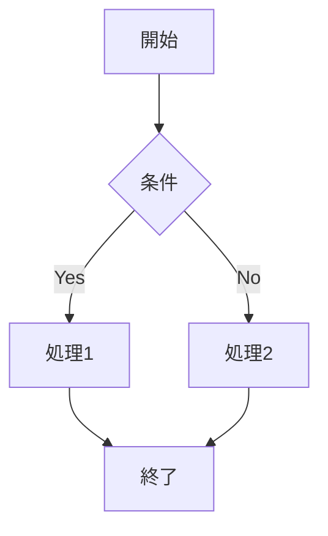

---

## 2. シーケンス図（Sequence Diagram）

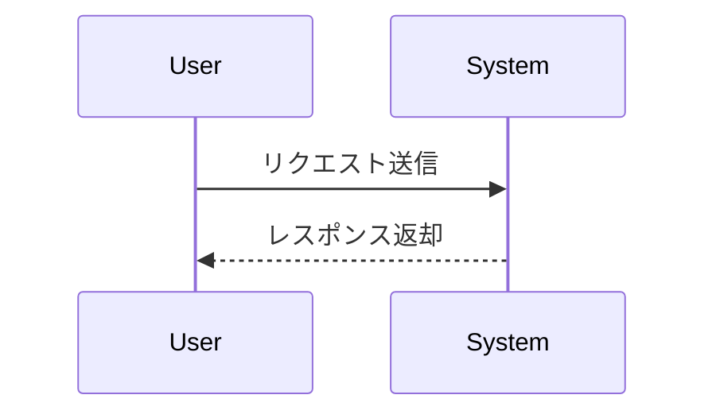

---

## 3. クラス図（Class Diagram）

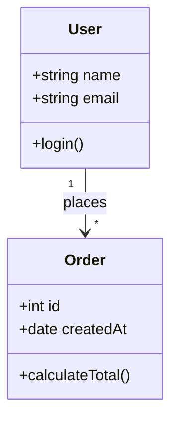

---

## 4. 状態遷移図（State Diagram）

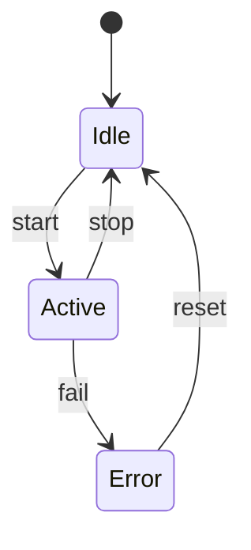

---

## 5. ER 図（Entity Relationship Diagram）

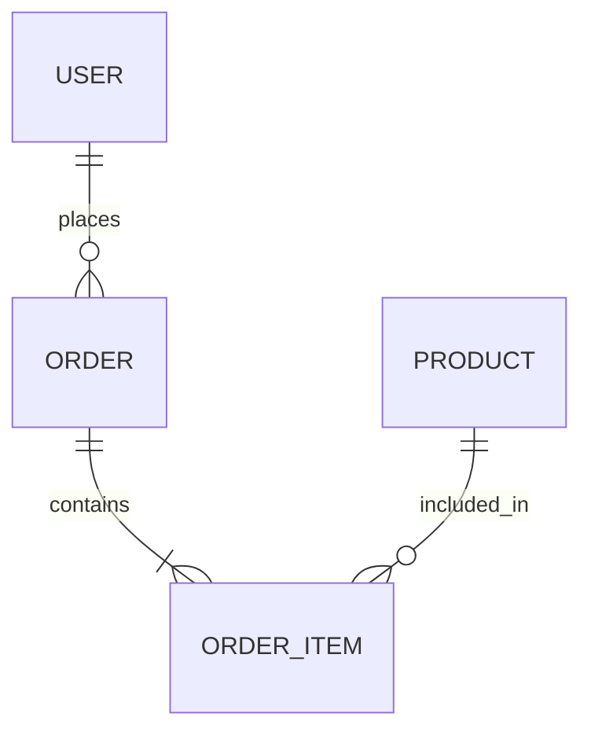

---

## 6. ガントチャート（Gantt Chart）

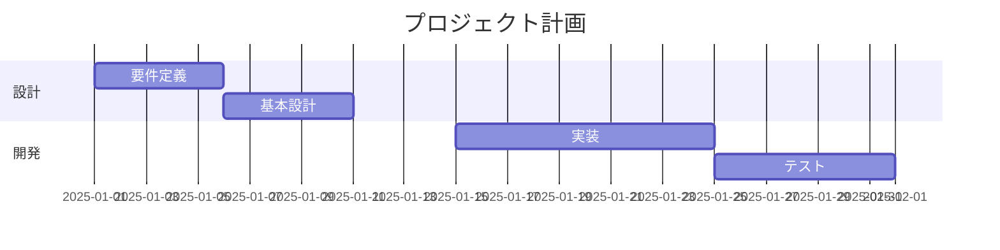

---

## 7. パイチャート（Pie Chart）

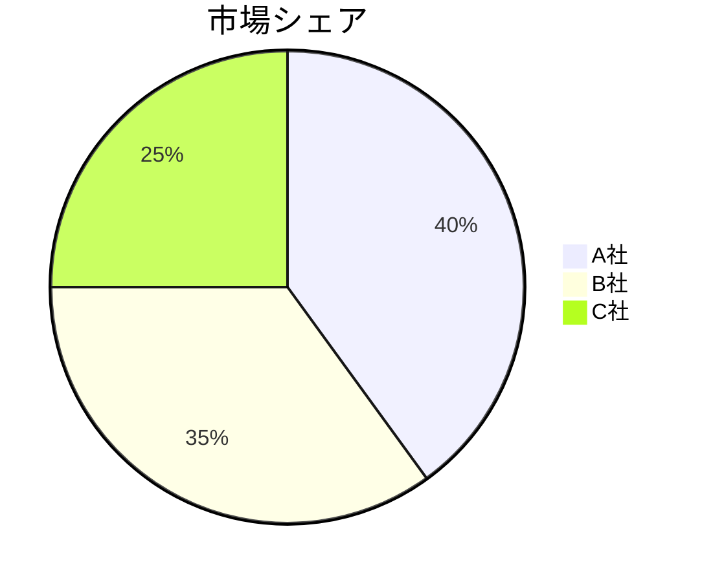

---

## 8. Git グラフ（Git Graph）

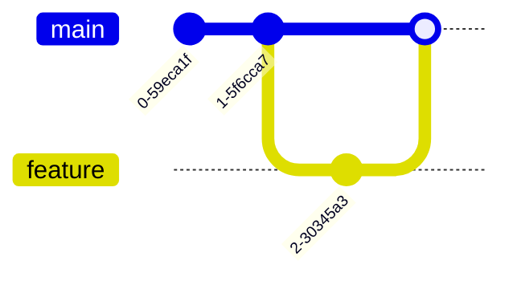

---

## 9. Journey（ユーザージャーニー図）

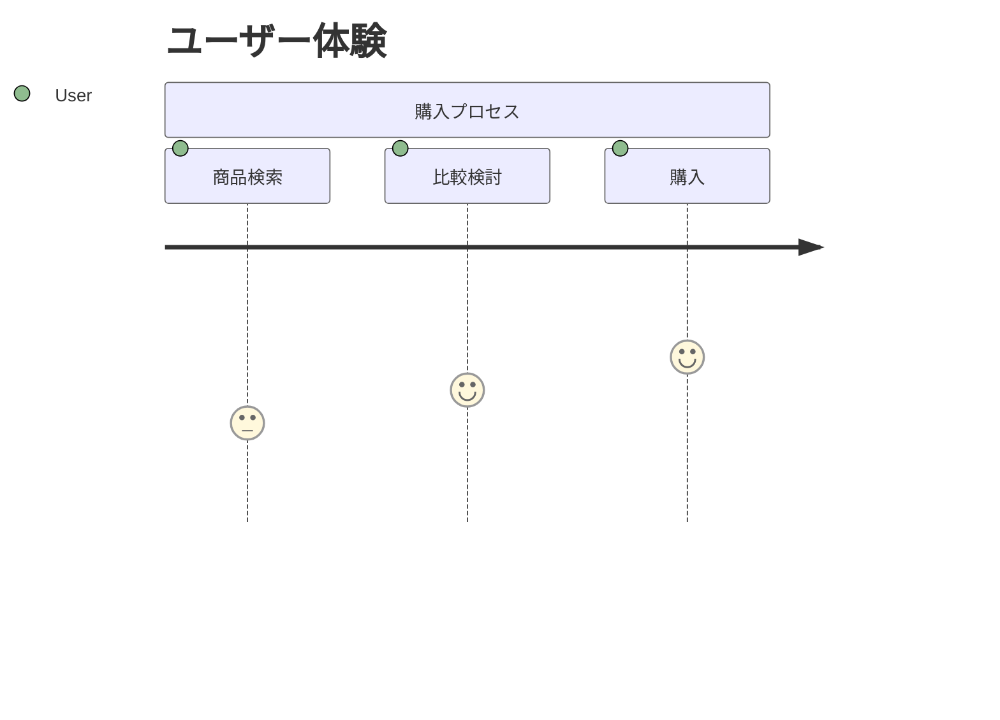

---

## 10. Mindmap（マインドマップ）

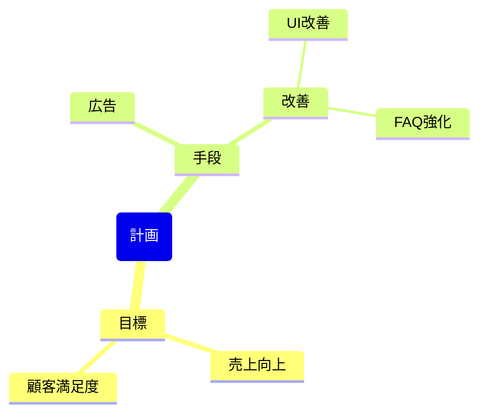

---

## 11. Timeline（タイムライン）

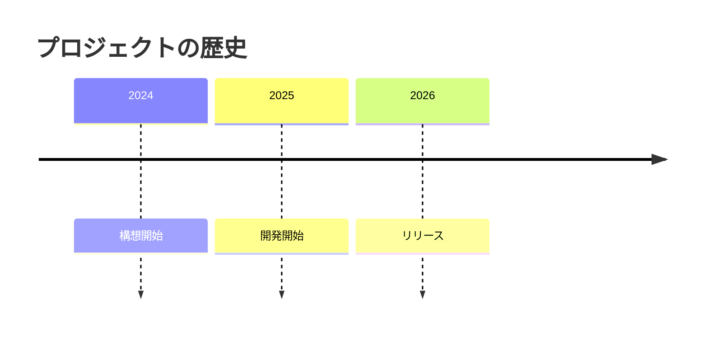

---

## 12. Quadrant Chart（象限チャート）

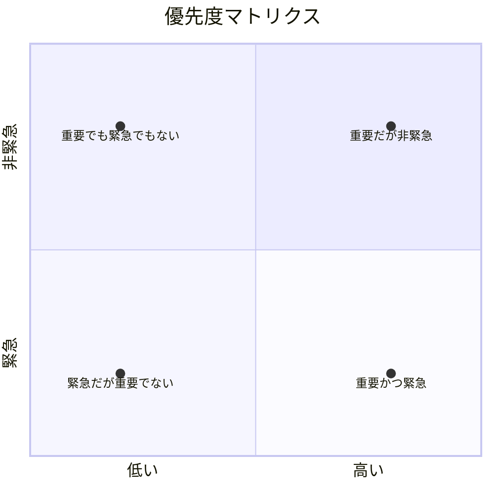

---

# ✅ PNG 画像埋め込みサンプル

```md

```

---

# ✅ ASCII アート図（Markdown 純正）

```
+-------+
| Start |
+-------+
    |
    v
+----------+
| Process  |
+----------+
```

